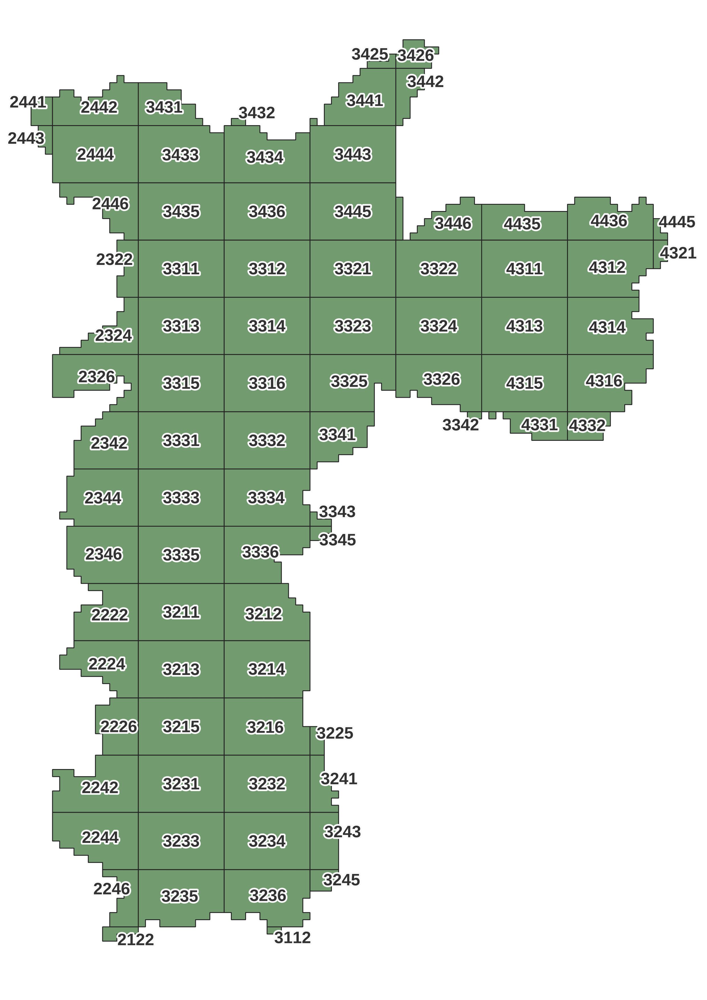

# Modelo de altura das edificações e vegetação de São Paulo a partir do LiDAR 3D

O Modelo de Superfície (MDS) LiDAR 3D contém o levantamento de pontos classificados de toda extensão da cidade de São Paulo. Volumetria e ocupação das edificações são abordagens do MDS LiDAR comum à diversas discilplinas do urbanismo. Trabalhar com o conjunto de dados total da cidade de São Paulo, não é uma tarefa trivial do ponto de vista de capacidade computacional. Uma das estratégias é criar produtos específicos mais simples e com foco em determinado aspecto, por exemplo o Modelo de Altura das edificações (MAE), também chamado de Building Height Model (BHM) ou Modelo de Altura das Copas (MAC) também chamado de Vegetation Height Model (VHM). Neste caso, um formato matricial (raster), com uma grade de 1m ou 50cm contendo a altura máxima em relação ao solo, dos pontos classificados como edificação ou vegetação.

## Objetivo

Este repositório tem o objetivo de documentar o processo de obtenção do Raster das edificações e copas de São Paulo a partir do LiDAR 3D, assim como publicar e disponibilizar os resultados obtidos. Dessa maneira, pretendemos dar autonomia a quem deseja utilizar os dados processados, mas também aos que querem reproduzir, alterar ou melhorar o processamento com outros parâmetros, para diversas finalidades.

## Materiais e métodos

Para obtenção do resultado, foi utilizado Python e a biblioteca Pdal afim de acessar os dados da publicação da nuvem de pontos LiDAR MDS da Cidade de São Paulo. A cidade foi particionada em uma articulação UTM, baseada no [SCM](https://github.com/geoinfo-smdu/SCM) na escala de 1:25000, onde cada quadrícula recebe um número conforme o mapa abaixo

## Resultados

Os resultados processados com resolução espacial de 1m e precisão de altura de 16 bits estão disponíveis na pasta `resultados` em arquivos raster GeoTiff, que podem ser abertos e visualizados no QGis e em diversos softwares de GeoProcessamento.

Os arquivos do Modelo de Altura das Edificações (MAE) Ou Building Height Model (BHM) são nomeados conforme o padrão ` BHM-0-merged-XXXX-1m-16bits.tif`, onde `XXXX` é o número da quadrícula, assim como o Modelo de Altura das Copas (vegetação) (MAC) ou Vegetation Height Model (VHM) seguindo a mesma lógica.

### Resultados mais recentes e precisos no Kaggle

Mais recentemente, um processameto com uma resolução espacial de 50cm e 32 bits, ou seja, mais preciso e denso, foi disponibilizado na plataforma Kaggle e deve ser utilizado preferencialmente. Os métodos dos processamentos estão disponíveis aqui neste repositório, no entanto, os dados, para esta precisão, por serem maiores, só podem ser acessados pelo Kaggle pelo seguinte endereço http://www.kaggle.com/andasampa/height-model

### Limitações dos resultados publicados no GitHub

Os resultados aqui obtidos utilizam um modelo de terreno e em algun casos, onde os desníveis são acentuados e as edificacões possuem poucos pavimentos, podem ocorrer valores negativos. Não se trata de um erro, é devido ao método de cálculo que subtrai o valor de Z do ponto classificado como edificação pelo valor correspondente do Z obtido pelo modelo de Terreno. Portanto, para alguns casos é importante recorrer diretamente ao dado LiDAR original.